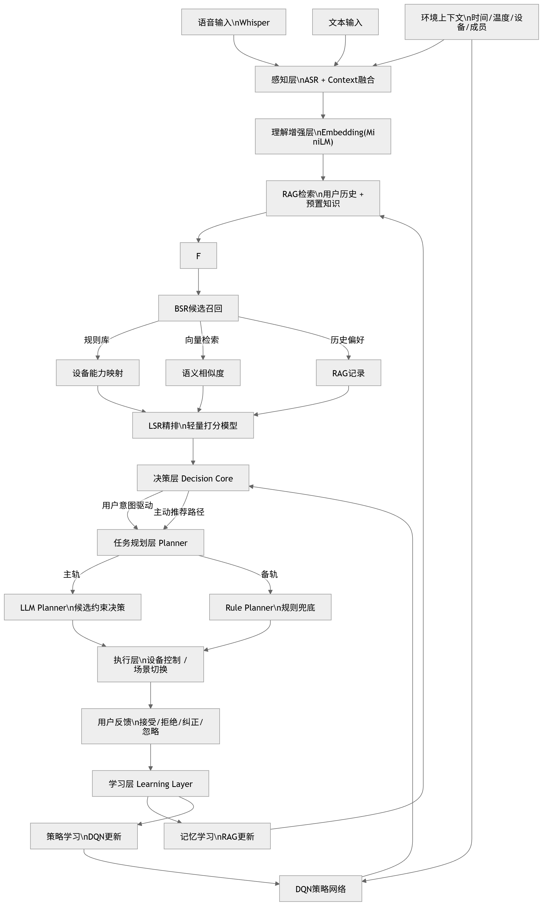

# HomeMind：家庭端侧模糊意图理解智能体

## 创新方案设计文档

**赛题方向：** 兴享智家

**提交语言：** Python

---

## 一、场景选择与痛点分析

### 1.1 场景选择

本方案选择 **家庭场景** ，聚焦于家庭成员与智能设备之间的日常交互问题。

### 1.2 核心痛点

现有智能家居产品（小米、华为、天猫精灵等）的本质是 **基于关键词匹配的指令执行器** ，而非真正的智能体。其核心缺陷表现在三个层面：

**指令理解层面：** 只能处理精确指令（"打开空调"），无法理解模糊表达（"有点闷"、"像昨天那样"）。用户被迫学习设备能听懂的说法，而不是用自然语言表达真实需求。

**学习能力层面：** 无跨会话记忆，每次交互均从零开始。用户反复设置相同偏好，系统从不学习，体验毫无进步。更不存在主动感知用户习惯、自主推荐合适场景的能力。

**数据安全层面：** 现有方案高度依赖云端推理，家庭行为数据、语音内容上传至云服务器，存在严重隐私风险。

### 1.3 创新定位

> **HomeMind** 是一个运行在家庭端侧设备上的智能体，能理解模糊自然语言指令，通过 RAG 保证回答可信，通过 DQN 强化学习主动感知用户习惯并推荐场景，并从用户每次交互中持续积累个性化知识——越用越懂你，且数据永不离开本地设备。

### 1.4 创新方向覆盖

| 赛题创新方向                     | 本方案实现                           | 定位 |
| -------------------------------- | ------------------------------------ | ---- |
| 基于轻量模型的意图理解与槽位填充 | Qwen2.5-0.5B INT4 + BSR+LSR 决策优化 | 地基 |
| 端侧Agent架构设计与任务规划      | 五层架构 + BSR+LSR + 双轨容错机制    | 支撑 |
| 模型压缩、蒸馏与量化技术         | INT4量化 + llama.cpp推理后端         | 支撑 |
| 本地知识库与检索增强生成         | ChromaDB + RAG 反馈闭环              | 主攻 |
| 低资源环境下的持续学习与适应     | DQN 场景推荐 + 知识库增量更新        | 主攻 |

---

## 二、系统架构设计

### 2.1 整体架构

系统采用五层架构，形成完整的感知-召回-排序-决策-执行-学习闭环：

```
┌──────────────────────────────────────────────────────────┐
│                         交互层                            │
│   语音输入（Whisper-tiny）   文字输入   环境上下文注入      │
└─────────────────────────┬────────────────────────────────┘
                          │
┌─────────────────────────▼────────────────────────────────┐
│                       BSR 层                              │
│                      候选召回                              │
│  ┌──────────────┐  ┌──────────────┐  ┌──────────────┐     │
│  │   规则召回   │  │  向量召回    │  │  用户历史    │     │
│  │  设备能力   │  │  MiniLM     │  │    RAG      │     │
│  └──────────────┘  └──────────────┘  └──────────────┘     │
│                     ↓ Top-K 候选动作                      │
└─────────────────────────┬────────────────────────────────┘
                          │
┌─────────────────────────▼────────────────────────────────┐
│                       LSR 层                              │
│                      轻量精排                              │
│  ┌──────────────────────────────────────────────────┐   │
│  │  特征：语义相似度 + 环境特征 + 用户偏好            │   │
│  │  模型：MLP（极轻量，<5MB）                         │   │
│  └──────────────────────────────────────────────────┘   │
│                     ↓ Top-1/Top-3                        │
└─────────────────────────┬────────────────────────────────┘
                          │
┌─────────────────────────▼────────────────────────────────┐
│                         理解层                            │
│                                                          │
│   ┌─────────────────────────────┐   ┌─────────────────┐  │
│   │  LLM 决策与参数生成          │   │   DQN 场景推荐   │  │
│   │  Qwen2.5-0.5B INT4          │   │   主动感知习惯   │  │
│   │  只做选择 + 参数输出        │   │   轻量策略网络   │  │
│   └──────────────┬──────────────┘   └────────┬────────┘  │
│                  │    ←→  RAG 检索增强        │           │
└──────────────────┼────────────────────────────┼───────────┘
                   │                            │
┌──────────────────▼────────────────────────────▼───────────┐
│                         执行层                             │
│      任务规划 → 工具调用（设备控制/信息查询/场景切换）      │
│                      ↓ 用户反馈收集                        │
└──────────────────────────┬─────────────────────────────────┘
                           │
┌──────────────────────────▼─────────────────────────────────┐
│                         学习层                              │
│   知识库增量更新（ChromaDB写回）  DQN经验回放池 → 策略更新  │
│              ↑──────────────────────────────────────↑      │
│                        RAG闭环                             │
└─────────────────────────────────────────────────────────────┘
```

### 2.2 两层核心创新闭环

**闭环一：RAG 知识库持续更新**

```
用户纠正智能体的回答
         ↓
纠正记录写入 ChromaDB（本地向量数据库）
         ↓
下次遇到同类问题，RAG 优先检索该记录
         ↓
模型基于真实记录回答，不再犯同样错误
```

**闭环二：DQN 强化学习持续优化**

```
环境状态（时间/温度/在家人数/历史场景）
         ↓
DQN 策略网络 → 推荐场景动作
         ↓
用户接受/拒绝/忽略 → 奖励信号
         ↓
经验回放池积累 → 轻量策略更新
         ↓
推荐准确率持续提升
```

### 2.3 BSR 候选召回设计（关键优化）

采用三路融合策略召回候选动作：

#### (1) 规则召回（必须具备）

基于设备能力和专家知识建立规则映射：

```
"闷" → 空调 / 风扇 / 开窗
"暗" → 灯光调亮
"吵" → 音量降低
"热" → 空调温度降低
"冷" → 空调温度升高
```

优点：零成本、极稳定、可控

#### (2) 向量召回（MiniLM）

使用预训练的 all-MiniLM-L6-v2 将用户输入和动作描述向量化，通过余弦相似度检索 Top-K 候选动作。

```python
topk_actions = vector_db.similarity_search(query, k=5)
```

#### (3) 用户历史（RAG）

根据用户历史行为调整召回权重：

```
用户过去：
"闷" → 开空调（被接受）
→ 该候选动作权重提升
```

#### BSR 输出

```
Top-K 候选动作（3~5个）
```

### 2.4 LSR 轻量精排设计（关键优化）

在 BSR 召回后，使用轻量打分模型进行精排：

#### 输入特征

```python
features = [
    sim(query, action),       # 语义相似度
    temperature,              # 当前温度
    humidity,                 # 当前湿度
    hour,                     # 当前时间
    user_preference_score,    # 用户历史偏好
]
```

#### 模型（极轻量）

```python
# 线性模型或 MLP
score = w1*f1 + w2*f2 + ...   # 线性模型
# 或
MLP(5 → 16 → 1)               # 参数量 < 1KB
```

#### 输出

```
Top-1 或 Top-3 动作
```

### 2.5 LLM 角色转变（关键设计）

**优化前：**

```
LLM：理解 + 找动作 + 决策
```

**优化后：**

```
LLM：只做两件事
1. 在候选中选最合适的动作
2. 生成参数
```

#### Prompt 示例

```
用户输入：有点闷

候选动作：
1. 打开空调（推荐）
2. 打开风扇
3. 打开窗户

当前环境：
温度28°C，湿度75%

请从候选中选择最合适的动作，并输出JSON：
{
  "action": "",
  "params": {}
}
```

优势：稳定性 ↑、幻觉 ↓、结构正确率 ↑

### 2.6 双轨容错机制

任务规划采用双轨设计，保证系统稳健性：

* **主轨（BSR+LSR+LLM 决策）：** 正常流程，BSR 召回 → LSR 精排 → LLM 最终决策
* **备轨（规则树兜底）：** 当置信度低于阈值或模型输出格式异常时，自动降级至预设规则

---

## 三、AI 模型与算法说明

### 3.1 模型选型与资源分配

| 模块                    | 模型/技术        | 量化方式  | 内存占用          |
| ----------------------- | ---------------- | --------- | ----------------- |
| 意图理解与生成          | Qwen2.5-0.5B     | INT4 量化 | ~500MB            |
| 语音识别（ASR）         | Whisper-tiny     | FP16      | ~150MB            |
| 文本向量化（Embedding） | all-MiniLM-L6-v2 | FP32      | ~30MB             |
| 向量数据库              | ChromaDB（本地） | —        | ~50MB             |
| DQN 策略网络            | 自研轻量网络     | FP32      | <5MB              |
| 系统开销                | —               | —        | ~500MB            |
| **合计**          |                  |           | **~1.24GB** |

全部组件在 4GB 内存设备上可同时运行，留有充足余量（约2.76GB）。

### 3.2 模糊意图理解

**环境上下文注入：** 每次推理前，将当前环境状态拼入 Prompt，使模型具备场景感知能力。

```python
context = {
    "time": "22:30",
    "temperature": 28,
    "humidity": 75,
    "devices": {"空调": "关", "灯": "开"},
    "members_home": ["妈妈", "孩子"]
}
system_prompt = f"当前环境：{json.dumps(context, ensure_ascii=False)}\n请理解用户意图并输出结构化决策。"
```

**置信度评估与主动澄清：** 当模型输出置信度低于阈值（默认 0.75）时，系统主动向用户提问，记录澄清结果并写入知识库。

**意图输出格式：**

```json
{
  "intent": "睡眠模式",
  "confidence": 0.91,
  "devices": ["灯光", "空调", "电视"],
  "params": {"灯光亮度": 10, "空调温度": 26, "电视": "关"}
}
```

### 3.3 RAG 检索增强生成

RAG 模块在系统中承担双重角色，协同工作：

#### 角色一：BSR 层的历史召回

RAG 存储用户历史行为，在候选召回阶段提供用户偏好特征：

```
RAG 检索用户历史：
"闷" → 28°C以上偏好开空调（被接受3次）
→ 作为 BSR 召回权重调整依据
→ 同时作为 LSR 用户偏好特征输入
```

#### 角色二：LLM 决策的上下文增强

RAG 模块由两类知识构成，协同工作：

**预置知识库（冷启动用）：** 包含家用电器使用常识、健康建议、家庭常见场景规则等，确保系统在无用户历史数据时也能给出合理回答。

**用户积累知识库（持续更新）：** 存储用户的历史纠正记录、偏好设置、场景关联等，随使用时间增长。

检索时优先返回用户积累知识，其次是预置知识，最终拼入上下文供模型生成回答，从根本上避免模型幻觉。

### 3.4 DQN 场景推荐模块（强化学习）

#### 状态空间设计

```python
state = {
    "hour": 22,            # 当前小时（0-23）
    "members_home": 2,     # 在家人数
    "temperature": 28,     # 室内温度
    "last_scene": 3,       # 上一个场景模式编号
    "day_of_week": 4       # 星期几（0=周一）
}
# 向量化为 5 维输入
```

#### 动作空间设计

```python
SCENES = {
    0: "睡眠模式",
    1: "待客模式",
    2: "离家模式",
    3: "观影模式",
    4: "起床模式",
    5: "无推荐"      # 不主动打扰用户
}
```

#### 奖励函数设计

```python
def get_reward(user_response: str) -> float:
    rewards = {
        "接受": +1.0,    # 用户采纳推荐
        "忽略":  0.0,    # 用户未响应
        "拒绝": -0.5,    # 用户明确拒绝
        "纠正": -1.0,    # 推荐场景完全错误
    }
    return rewards.get(user_response, 0.0)
```

#### 网络结构（极轻量）

```python
# 5维输入 → 32隐层 → 6维输出（对应6个动作）
# 参数量 < 1000个，模型文件 < 5MB
class DQN(nn.Module):
    def __init__(self):
        super().__init__()
        self.net = nn.Sequential(
            nn.Linear(5, 32),
            nn.ReLU(),
            nn.Linear(32, 6)
        )

    def forward(self, x):
        return self.net(x)
```

#### 训练策略

```
离线阶段（PC上完成）：
  用合成数据预训练，覆盖基础场景规律
  例：晚上22点 + 2人在家 → 大概率睡眠模式
  例：白天 + 0人在家 → 大概率离家模式
         ↓
端侧部署后（增量更新）：
  每积累50条用户反馈，触发一次轻量更新
  仅更新策略网络权重（< 5MB），不涉及LLM
  ε-greedy 探索策略逐步衰减，平衡探索与利用
```

#### 与主体架构的接入点

DQN 仅负责 **主动推荐** ，用户主动下指令时走意图理解流程，两条路互不干扰：

```
环境上下文
    ↓
DQN策略网络
    ↓
主动推荐："现在是晚上10点，要切换到睡眠模式吗？"
    ↓
用户反馈 → 奖励信号 → 经验回放池（容量1000条）→ 增量更新
```

### 3.5 BSR+LSR 轻量级架构设计

本系统采用"轻量 BSR + 轻量 LSR"架构，而非 GNN 或 DMM，核心原因如下：

#### 为何不做 GNN（图神经网络）

* **缺乏复杂图结构：** 家庭设备关系简单（空调、灯光、电视等），无需建模设备间复杂关系
* **引入成本高：** GNN 需要构建邻接矩阵、特征传播，推理开销大
* **收益很小：** 对于设备控制场景，GNN 的图推理能力无法发挥
* **结论：** GNN 在该场景下属于典型过度设计

#### 为何不做 DMM（深度匹配模型）

* **推理速度慢：** DMM 参数量大，推理延迟高
* **资源占用高：** 与 LLM 功能重叠，不适合端侧部署
* **性价比低：** 在已有 MiniLM 向量检索的情况下，DMM 排序精度提升有限
* **结论：** DMM 在该场景下性价比很低

#### 本方案选型依据

| 方案          | 是否适合端侧 | 复杂度 | 推理延迟 | 结论     |
| ------------- | ------------ | ------ | -------- | -------- |
| GNN           | ❌           | 高     | 中       | 过度设计 |
| DMM           | ❌           | 高     | 高       | 性价比低 |
| 规则+向量召回 | ✅           | 低     | <10ms    | 稳定可控 |
| MLP 精排      | ✅           | 极低   | <1ms     | 轻量高效 |
| LLM 决策      | ✅           | 中     | 中       | 功能完整 |

该架构让 LLM 从"全盘理解"转变为"决策选择"，大幅缩小决策空间，提升稳定性并降低幻觉。

### 3.6 为何不做模型权重微调

端侧模型微调（全量）需要在内存中同时保存权重、梯度、优化器状态和激活值，总计约 2.5GB 以上，加上其他模块将超出 4GB 限制。当前持续学习通过两种轻量机制实现：其一是知识库的持续更新（RAG闭环），其二是 DQN 策略网络的增量更新（< 5MB）。两种机制均完全在端侧完成，资源开销可控。LoRA 轻量微调留作未来扩展方向。

---

## 四、工具函数设计与调用逻辑

### 4.1 工具清单

**设备控制工具（device_control）**

```python
def device_control(device: str, action: str, params: dict = {}) -> dict:
    """
    控制家庭设备
    device: 空调 / 灯光 / 电视 / 热水器 / 音响
    action: on / off / adjust
    params: 设备相关参数（温度、亮度、音量等）
    """
```

**信息查询工具（info_query）**

```python
def info_query(query_type: str, params: dict = {}) -> dict:
    """
    查询信息并作为推理上下文
    query_type: temperature / history / weather / schedule / preference
    """
```

**场景模式切换工具（scene_switch）**

```python
def scene_switch(scene: str) -> dict:
    """
    切换预设场景，批量执行多设备操作
    scene: 睡眠 / 待客 / 离家 / 起床 / 观影
    """
```

**知识库写入工具（kb_write）**

```python
def kb_write(content: str, category: str, user_feedback: str) -> bool:
    """
    将用户纠正/偏好写入 ChromaDB
    由学习层调用，非用户直接触发
    """
```

**DQN 反馈记录工具（dqn_feedback）**

```python
def dqn_feedback(state: dict, action: int, reward: float) -> bool:
    """
    记录用户对推荐场景的反馈，写入经验回放池
    触发条件：用户对DQN主动推荐做出响应
    """
```

### 4.2 任务规划的三种执行路径

**路径一：简单意图，直接映射**

```
用户："把灯关了"
→ 意图：{device: "灯", action: "关", confidence: 0.98}
→ Step1: device_control("灯", "off")
→ 完成
```

**路径二：复合意图，顺序执行**

```
用户："有客人来了"
→ 意图：{scene: "待客模式", confidence: 0.89}
→ Step1: device_control("客厅灯", "adjust", {brightness: 100})
→ Step2: device_control("空调", "adjust", {temp: 25})
→ Step3: device_control("音响", "on", {volume: 30, mode: "背景音乐"})
→ 完成
```

**路径三：模糊意图，查询后决策**

```
用户："有点闷"
→ 意图：{feeling: "闷热", confidence: 0.78}
→ Step1: info_query("temperature") → 返回：28°C，湿度75%
→ Step2: info_query("preference") → 返回：28°C以上偏好开空调
→ Step3: device_control("空调", "on", {temp: 26})
→ 回复："已为您开启空调，温度设定26度。"
→ Step4: kb_write(用户接受该决策，写入知识库)
```

---

## 五、性能优化措施

### 5.1 推理延迟优化

* Qwen2.5-0.5B 采用 INT4 量化，相比 FP16 推理速度提升约 2 倍，内存占用降低约 75%
* 使用 llama.cpp 作为推理后端（C++ 内核），Python 作为胶水层调用，性能瓶颈不在语言层
* 环境上下文和 RAG 检索结果在推理前一次性拼入，减少多次模型调用

### 5.2 RAG 检索加速

* ChromaDB 本地持久化，启动时加载至内存，检索延迟 < 10ms
* Embedding 向量预计算并缓存，避免重复计算
* 知识库按类别分区索引（预置知识 / 用户记录），缩小检索范围

### 5.3 DQN 推理极速

* 策略网络参数量 < 1000 个，单次推理 < 1ms，对系统延迟无影响
* 经验回放池容量固定为 1000 条，超出时滚动覆盖旧数据，内存占用恒定
* 增量更新异步执行，不阻塞主交互流程

### 5.4 冷启动优化

新设备首次使用时，预置知识库提供兜底回答，规则树保证基础场景可用，DQN 使用离线预训练权重提供基础推荐。随使用时间增长，RAG 和 DQN 均向用户个性化收敛，体验平滑过渡。

---

## 六、典型交互演示脚本

### 场景一：模糊环境感知（BSR+LSR+LLM 流程）

```
用户：  "有点闷"
-----------------------------------------
[BSR 候选召回]
  规则召回："闷" → 空调/风扇/开窗
  向量召回：Top-3 候选动作
  用户历史：28°C以上偏好开空调
  → 候选集：[打开空调, 打开风扇, 打开窗户]
-----------------------------------------
[LSR 轻量精排]
  特征输入：语义相似度(0.85) + 温度(28) + 湿度(75) + 用户偏好(0.9)
  MLP 打分：打开空调(0.92) > 打开风扇(0.65) > 打开窗户(0.58)
  → 精排结果：打开空调
-----------------------------------------
[LLM 决策]
  候选：打开空调
  环境：温度28°C，湿度75%
  输出：{"action": "打开空调", "params": {"temperature": 26}}
-----------------------------------------
系统：  "现在室内28度，帮您把空调开到26度？"
用户：  "好的"
系统：  [执行：device_control(空调, on, temp=26)]
        [写入知识库：用户确认了温度28°C开空调的偏好]
回复：  "已开启，晚安。"
```

### 场景二：历史指代消解（RAG 检索）

```
用户：  "像昨天晚上那样"
-----------------------------------------
[RAG 检索]
  检索历史记录：昨晚22:30，灯光亮度10%，空调26°C睡眠模式
-----------------------------------------
[BSR 召回]
  候选：睡眠模式相关动作
-----------------------------------------
[LLM 决策]
  输出：恢复昨晚设置
-----------------------------------------
系统：  "帮您恢复昨晚的设置：灯光调暗，空调26度睡眠模式，对吗？"
用户：  "对"
系统：  [批量执行设备控制]
        [DQN记录：22:30 + 2人在家 → 睡眠模式被接受，reward=+1.0]
回复：  "已恢复昨晚设置。"
```

用户：  "像昨天晚上那样"
系统：  [检索历史记录：昨晚22:30，灯光亮度10%，空调26°C睡眠模式]
回复：  "帮您恢复昨晚的设置：灯光调暗，空调26度睡眠模式，对吗？"
用户：  "对"
系统：  [批量执行设备控制]
        [DQN记录：22:30 + 2人在家 → 睡眠模式被接受，reward=+1.0]

```

### 场景三：DQN 主动推荐（独立流程）

```

系统：  [感知：时间22:15，在家2人，上次场景：观影模式]
------------------------------------------------------

[DQN 推理]
  状态：hour=22, members=2, temperature=25, last_scene=3, day=4
  Q值输出：睡眠模式=0.89 > 待客=0.12 > 离家=0.05
------------------------------------------------

主动：  "现在22点了，要切换到睡眠模式吗？"
用户：  "好的"
系统：  [执行：scene_switch(睡眠)]
        [dqn_feedback(state, action=0, reward=+1.0)]
        [经验回放池写入，累计第47条]
回复：  "已切换到睡眠模式。"

------（三天后）------

系统：  [同样状态，DQN已学习：该用户22点必切睡眠]
主动：  "帮您切换睡眠模式了。"  ← 不再询问，直接执行

```

### 场景四：主动澄清（置信度触发）

```

用户：  "调一下"
----------------

[意图理解]
  置信度：0.42 < 阈值0.75
-------------------------

系统：  "请问您想调节哪个设备？空调、灯光还是音量？"
用户：  "灯，亮一点"
系统：  [BSR+LSR 流程]
        [执行：device_control(灯, adjust, brightness+20%)]
        [写入知识库："调一下"在该时间段多指灯光]
回复：  "已帮您调亮灯光。"

```
系统：  [感知：时间22:15，在家2人，上次场景：观影模式]
        [DQN推理：Q值最大动作=睡眠模式，置信度高]
主动：  "现在22点了，要切换到睡眠模式吗？"
用户：  "好的"
系统：  [执行：scene_switch(睡眠)]
        [dqn_feedback(state, action=0, reward=+1.0)]
        [经验回放池写入，累计第47条]

------（三天后）------

系统：  [同样状态，DQN已学习：该用户22点必切睡眠]
主动：  "帮您切换睡眠模式了。"  ← 不再询问，直接执行
```

### 场景四：主动澄清

```
用户：  "调一下"
系统：  [置信度0.42，低于阈值0.75]
回复：  "请问您想调节哪个设备？空调、灯光还是音量？"
用户：  "灯，亮一点"
系统：  [执行：device_control(灯, adjust, brightness+20%)]
        [写入知识库："调一下"在该时间段多指灯光]
```

### 场景五：多轮任务延续

```
用户：  "我要出门了"
系统：  [执行：离家模式，关闭全部设备]
回复：  "已关闭空调、灯光和电视。预计几点回来？"
用户：  "晚上七点"
系统：  [写入日程：19:00 提前10分钟开启空调]
        [DQN记录：离家前询问回来时间被用户响应，reward=+1.0]
回复：  "好的，六点五十我会提前开好空调等您。"
```

---

## 七、可扩展性与实用性评估

### 7.1 商业价值

中兴通讯年家庭终端出货量超1亿台，HomeMind 的核心能力可直接集成至路由器、家庭网关等终端产品，无需额外硬件。相比云端方案，端侧部署显著降低服务运营成本，并从根本上解决隐私合规问题。DQN 个性化推荐模块尤其契合中兴"让AI服务于家庭每个成员"的产品方向。

### 7.2 扩展方向

**多模态扩展：** 在算力允许时加入视觉模态，通过摄像头感知房间人员状态，扩展 DQN 状态空间，提升推荐准确率。

**LoRA 轻量微调：** 在存储和算力余量充足时，探索对 LLM 权重做增量更新，进一步提升意图理解的个性化深度。

**多设备协同：** 扩展至家庭多终端部署，不同房间的设备共享同一知识库和 DQN 模型，实现全屋智能协同。

**家庭成员识别：** 通过声纹识别区分不同家庭成员，为每个成员维护独立的偏好知识库和 DQN 策略，实现真正的多用户个性化。

### 7.3 隐私与安全

* 所有推理、存储、学习（含 DQN 训练）均在本地设备完成，无任何用户数据上传云端
* 唯一的外部请求为天气 API，查询结果本地缓存，断网后仍可使用历史数据
* 知识库和 DQN 经验回放池采用本地加密存储

---

## 八、技术栈汇总

| 类别         | 技术选型                                 |
| ------------ | ---------------------------------------- |
| 开发语言     | Python 3.10+                             |
| 核心推理     | llama.cpp（C++内核）+ Qwen2.5-0.5B INT4  |
| 语音识别     | faster-whisper（C++内核）· Whisper-tiny |
| 向量检索     | ChromaDB（C++内核）+ all-MiniLM-L6-v2    |
| 强化学习     | PyTorch · 自研轻量 DQN                  |
| BSR 候选召回 | 规则引擎 + MiniLM 向量检索 + RAG 历史    |
| LSR 轻量精排 | 自研轻量 MLP（<5MB）                     |
| Agent 框架   | 自研轻量框架（无 LangChain 依赖）        |
| 演示环境     | PC 仿真（模拟家庭设备状态）              |
| 入口函数     | `main.py`→`run()`                   |

> 推理、语音识别、向量检索的底层均为 C++ 实现，Python 作为胶水层调用，性能瓶颈不在语言层。BSR+LSR 模块资源开销极低（<10MB），对系统延迟无影响。

---

*文档版本：v3.0 | 赛题：2026中兴捧月·兴享智家*
